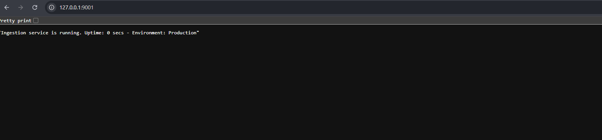
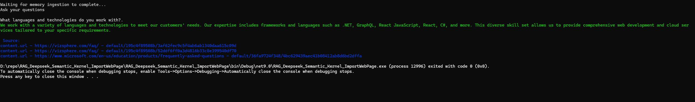
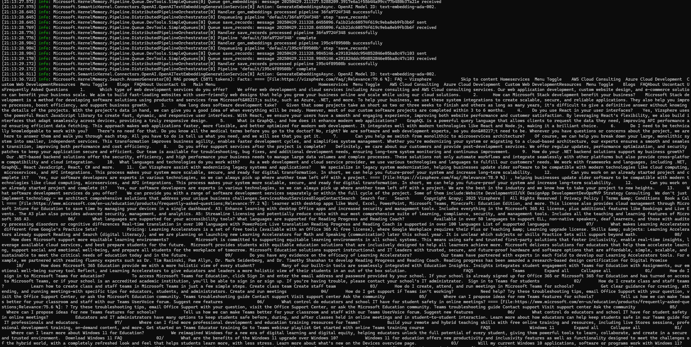

# RAG using DeepSeek R1, Ollama & Semantic Kernel .NET

## 1. Install ollama on windows https://ollama.com/download 

## 2. Pull & run DeepSeek LLM locally on ollama platform 

``` ollama run deepseek-r1:1.5b ```

``` ollama list ```

## 3. Setup/Create Deep Seek API Account 
You need to set up an account in Deep Seek and create an API key from here. https://platform.deepseek.com/api_keys 

## 4. Deploy Kernel Memory on docker as service

You will need to install the Kernel Memory service on Docker, as it will effectively serve as your dataset indexing platform.


```  docker run -e OPENAI_API_KEY="YOUR_DEEPSEEK_API_KEY" -p 9001:9001 -it --rm kernelmemory/service  ```




## Questions


### Document source 1

What is Microsoft 365 Education?

What is the difference between Office 365 and Microsoft 365 Education?

Where can I learn more about Windows 11 Education?


### Document source 2 


Which type of web development services do you offer?

How do your .NET backend solutions support my business growth?

What languages and technologies do you work with?






